<div align="center">



<br/><br/>


<br/><br/>

<a href="https://www.linkedin.com/in/ishmeet-kaur/"></a>
<a href="mailto:ishmeet.kaur0407@gmail.com"></a>
<a href="https://github.com/ishmeeeeet04"></a>

<br/><br/>


</div>

<br/>


## `01.` About Me

```yaml
whoami:
  name:        "Ishmeet Kaur"
  role:        "Cybersecurity Engineer · AI/ML Security Researcher"
  university:  "VIT Bhopal — B.Tech CSE (Cyber Security & Digital Forensics)"
  cgpa:        "8.23 / 10"
  mindset:     "Break it to understand it. Build it to defend it."

current_ops:
  - "Cloud Security Intern @ Arglin Tech — anomaly detection on IAM/VPC logs"
  - "Researching hybrid ML + rule-based threat detection pipelines"
  - "3x IEEE-track published papers — AI security, TinyML, network coding"
  - "Top 2.2% — Amazon ML Summer School 2026"

open_to:
  - "AI/ML Engineer & Security Engineer roles"
  - "AppSec / Threat Detection internships"
  - "Applied ML + Security research collaborations"
```

<br/>


## `02.` Threat Matrix — Tech Arsenal

<div align="center">

**Languages**
<br/>


<br/><br/>

**AI / ML / Security Stack**
<br/><br/>


<br/><br/>

**Offensive / Defensive Security**
<br/><br/>


<br/><br/>

**Backend, Cloud & DevOps**
<br/>


</div>

<br/>


## `03.` Breach Log — Featured Operations

<table width="100%">
<tr>
<td width="100%">

### 🎣 AI-Powered Phishing Email Detection System
**Cybersecurity ML + NLP** &nbsp;|&nbsp; `Python` `Flask` `Scikit-learn` `TF-IDF` `NLTK` `VirusTotal API`

- Built a **3-layer detection engine** (Logistic Regression + TF-IDF + VirusTotal API) hitting **94%+ accuracy** on a real-world email corpus
- Weighted **0–100 threat-scoring system** with explainability, served via a rate-limited Flask REST API
- Shipped a **dark-mode security dashboard** with animated SVG risk visualization for live scans

`[ REPO: github.com/ishmeeeeet04/phishing-detector ]`

</td>
</tr>
<tr>
<td width="100%">

### 🕵️ AI-Powered Threat Detection & Log Analysis System
**Cybersecurity ML & Full-Stack** &nbsp;|&nbsp; `Python` `Flask` `Scikit-learn` `SQLite` `GitHub Actions`

- Hybrid anomaly-detection pipeline (**Isolation Forest + heuristics**) — **87% precision, 100% recall** on the NSL-KDD benchmark
- **CORS-hardened, 8-endpoint** Flask REST API with CI/CD via GitHub Actions + **13 automated tests**
- Flagged **6 real-world attack patterns** across 1,000 scored logs via a live interactive dashboard on Render

`[ REPO: github.com/ishmeeeeet04/threat-detection-system ]`

</td>
</tr>
<tr>
<td width="100%">

### 🤖 AI-Powered Autonomous SOC Analyst
**Cybersecurity ML & AI** &nbsp;|&nbsp; `Python` `React` `Flask` `LangChain/RAG` `Gemini API`

- Hybrid detection engine (rules + **Random Forest**) mapped to **MITRE ATT&CK** (T1110, T1078) with **SHAP explainability**
- **RAG pipeline** (ChromaDB + Gemini) auto-generates grounded incident summaries — deployed full-stack on Render/Vercel
- Boosted recall from **4.1% → 61.9%** (~15x) with the hybrid model, validated at **96.6% precision** on NSL-KDD

`[ REPO: github.com/ishmeeeeet04/ai-soc-analyst ]`

</td>
</tr>
</table>

<br/>


## `04.` Field Deployment — Experience

<table width="100%">
<tr>
<td>

**Cloud Security Intern** — Arglin Tech Pvt. Ltd. <br/>
<sub>Noida, UP · May 2026 – June 2026</sub>

- Built an **unsupervised anomaly detection pipeline** (Isolation Forest, scikit-learn) across 5 engineered features (user, IP, resource, action type, access frequency) to flag suspicious activity in cloud IAM/VPC-style and database access logs
- Designed a **3-tier severity-scoring system** combining model output with contextual rules, exposed via a rate-limited, input-validated Flask REST API and a React dashboard for real-time review

</td>
</tr>
<tr>
<td>

**Content Lead** — IEEE Student Branch, VIT Bhopal
- Authored technical reports/newsletters on emerging cybersecurity & AI/ML trends — **boosted branch visibility by 40%**

</td>
</tr>
<tr>
<td>

**Event Lead** — OWASP Club, VIT Bhopal
- Led execution of **8+ cybersecurity & AI/ML workshops** — **boosted participant turnout by 35%**

</td>
</tr>
</table>

<br/>


## `05.` Clearance Level — Achievements & Publications

<div align="center">

| 🏆 | Recognition |
|:---:|:---|
| 🥇 | **Amazon ML Summer School 2026** — selected from the **top 2.2%** of applicants |
| ☁️ | **Google IT Support Certified** (Jan 2026) |
| 📄 | *A Novel Approach in Malware Detection with Cryptography Based Approach Using Machine Learning* |
| 📄 | *Enhanced Consumer Healthcare Data Protection Through AI-Driven TinyML and Privacy-Preserving Techniques* |
| 📄 | *Network Coding for Fault-Tolerant Transmission of Biomedical Data* |

</div>

<br/>


## `06.` System Diagnostics — GitHub Analytics

<div align="center">


<br/>


<br/>


</div>

<br/>


## `07.` 3D Commit Terrain — Contribution Calendar

<div align="center">

<!--START_3D_CONTRIB-->

<!--END_3D_CONTRIB-->

<sub>Auto-rendered nightly by <code>.github/workflows/3d-contrib.yml</code> — see setup notes below</sub>

</div>

<br/>


## `08.` Intrusion Simulation — Contribution Snake

<div align="center">

<!--START_SNAKE-->

<!--END_SNAKE-->

<sub>Auto-rendered daily by <code>.github/workflows/snake.yml</code> — see setup notes below</sub>

</div>

<br/>


## `09.` Coding Profiles

<div align="center">

<a href="https://leetcode.com/ishmeeeeet04"></a>
<a href="https://auth.geeksforgeeks.org/user/ishmeeeeet04"></a>
<a href="https://hackerrank.com/ishmeeeeet04"></a>
<a href="https://codechef.com/users/ishmeeeeet04"></a>

</div>

<br/>


<div align="center">


</div>
