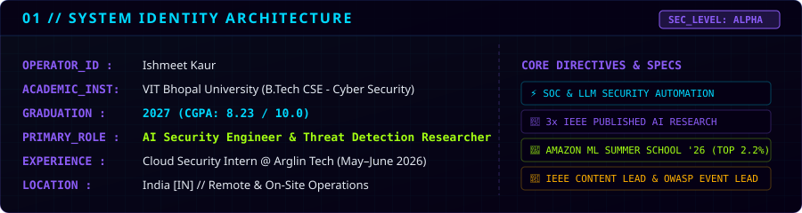
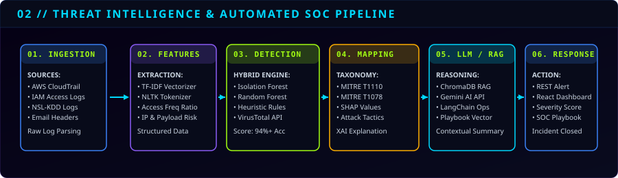
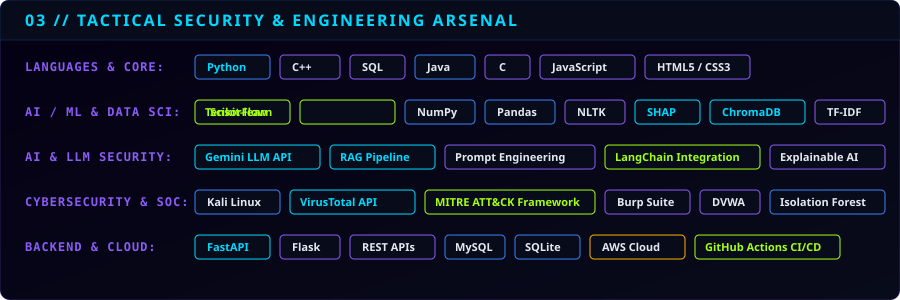
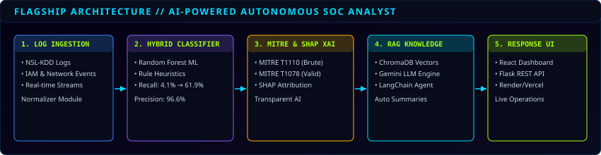
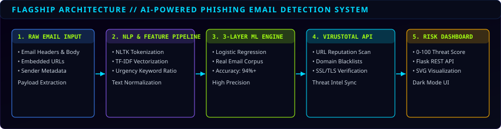
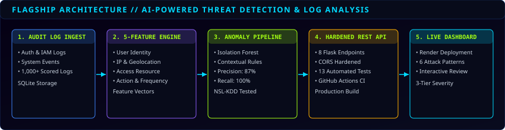
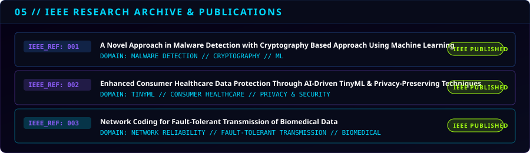
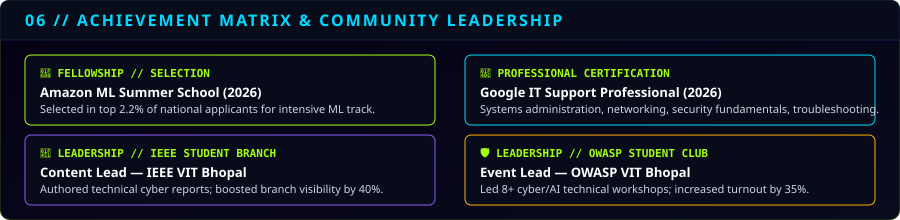
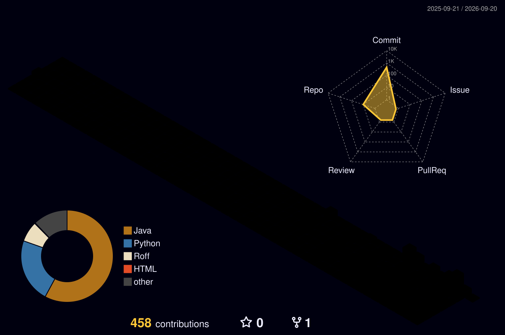

<div align="center">
  
</div>

<br />

```
╔═══════════════════════════════════════════════════════════════════════════════════════════════════════╗
║ OPERATOR: ISHMEET KAUR | CLEARANCE: LEVEL 5 (THREAT INTEL & AI SECURITY) | STATUS: OPERATIONAL       ║
║ SYSTEM: ISHMEET.OS v4.0 | DIRECTIVE: AUTONOMOUS THREAT DETECTION, LLM SECURITY & CLOUD INFRASTRUCTURE ║
╚═══════════════════════════════════════════════════════════════════════════════════════════════════════╝
```

---

## 01 // SYSTEM IDENTITY & OVERVIEW

<div align="center">
  
</div>

<br />

> **I architect intelligent security systems at the convergence of Artificial Intelligence, Threat Detection, and Cloud Infrastructure.**
> 
> My engineering focus centers on detecting cyber threats in real time, explaining anomaly patterns using XAI, automating SOC workflows using LLMs & RAG, and hardening cloud & AI systems against modern attack vectors. Rather than relying solely on static rule sets, I design hybrid detection pipelines that synthesize statistical machine learning, deep NLP, and real-time threat intelligence feeds.

---

## 02 // THREAT INTELLIGENCE & AUTOMATED SOC PIPELINE

<div align="center">
  
</div>

<br />

```
+------------------+     +------------------+     +------------------+     +------------------+
| 01. INGESTION    | --> | 02. FEATURES     | --> | 03. DETECTION    | --> | 04. MAPPING      |
| AWS / IAM / Logs |     | TF-IDF / NLTK    |     | Isolation Forest |     | MITRE ATT&CK     |
+------------------+     +------------------+     +------------------+     +------------------+
                                                                                    |
                                                                                    v
+------------------+                              +------------------+     +------------------+
| 06. INCIDENT CLOSED| <-------------------------- | 06. RESPONSE UI  | <-- | 05. LLM / RAG    |
| Automated Action |                              | React / Flask    |     | Gemini + Chroma  |
+------------------+                              +------------------+     +------------------+
```

---

## 03 // TACTICAL SECURITY & ENGINEERING ARSENAL

<div align="center">
  
</div>

<br />

<details>
<summary><b>🔍 View Full Arsenal Specifications</b></summary>

<br />

| Domain | Tactical Technologies & Frameworks |
| :--- | :--- |
| **Programming Languages** | Python, C++, SQL, Java, C, JavaScript (ES6+), HTML5, CSS3 |
| **AI / Machine Learning** | TensorFlow, Scikit-learn, NumPy, Pandas, NLTK, SHAP, ChromaDB, Joblib, TF-IDF |
| **AI Security & LLMs** | Gemini API, RAG (Retrieval-Augmented Generation), Prompt Engineering, LangChain |
| **Cybersecurity & SOC** | Kali Linux, VirusTotal API, DVWA, Burp Suite, MITRE ATT&CK Framework |
| **Backend & Cloud** | FastAPI, Flask REST APIs, MySQL, SQLite, Firebase, AWS Cloud, Render, Vercel |
| **DevOps & Testing** | Git, GitHub Actions (CI/CD), Postman, Overleaf |

</details>

---

## 04 // FLAGSHIP MISSIONS & PROJECTS

### 🛡️ FLAGSHIP MISSION 01: AI-Powered Autonomous SOC Analyst
> **Repository:** [`ishmeeeeet04/ai-soc-analyst`](https://github.com/ishmeeeeet04/ai-soc-analyst) | **Domain:** Cybersecurity ML & RAG

<div align="center">
  
</div>

<br />

```
╔═══════════════════════════════════════════════════════════════════════════════════════════════════════╗
║ MISSION LOG: OPERATION // AI-SOC-ANALYST                                                              ║
║ MISSION DIRECTIVE: BUILD AN AUTONOMOUS THREAT ANALYSIS & INCIDENT TRIAGE ENGINE                       ║
╠═══════════════════════════════════════════════════════════════════════════════════════════════════════╣
║ • Hybrid Detection Engine: Synthesizes rule-based heuristics with Random Forest ML for threat triaging.║
║ • MITRE ATT&CK Mapping: Automatically maps anomalies to T1110 (Brute Force) & T1078 (Valid Accts).  ║
║ • Explainable AI (XAI): Integrates SHAP values to explain feature contribution for every alert.       ║
║ • RAG Knowledge Retrieval: Integrates ChromaDB + Gemini LLM to auto-generate grounded playbooks.      ║
║ • Operational Impact: Boosted recall from 4.1% (rules-only) to 61.9% (~15x) at 96.6% precision.        ║
╚═══════════════════════════════════════════════════════════════════════════════════════════════════════╝
```

---

### 🎣 FLAGSHIP MISSION 02: AI-Powered Phishing Email Detection System
> **Repository:** [`ishmeeeeet04/phishing-detector`](https://github.com/ishmeeeeet04/phishing-detector) | **Domain:** Cybersecurity ML & NLP

<div align="center">
  
</div>

<br />

```
╔═══════════════════════════════════════════════════════════════════════════════════════════════════════╗
║ MISSION LOG: OPERATION // PHISHING-DETECTOR                                                           ║
║ MISSION DIRECTIVE: 3-LAYER PHISHING DETECTION ENGINE WITH REAL-TIME THREAT SCORING                   ║
╠═══════════════════════════════════════════════════════════════════════════════════════════════════════╣
║ • 3-Layer Detection Engine: Combines Logistic Regression, TF-IDF NLP, and VirusTotal API lookup.     ║
║ • High Precision Corpus: Achieved 94%+ detection accuracy on real-world email datasets.               ║
║ • Threat Scoring: Computes a weighted 0-100 risk score with explainable indicator highlights.         ║
║ • Full-Stack API: Served via rate-limited Flask REST API with dark-mode SVG risk visualization dashboard.║
╚═══════════════════════════════════════════════════════════════════════════════════════════════════════╝
```

---

### 📊 FLAGSHIP MISSION 03: AI-Powered Threat Detection & Log Analysis System
> **Repository:** [`ishmeeeeet04/threat-detection-system`](https://github.com/ishmeeeeet04/threat-detection-system) | **Domain:** Anomaly Detection & Cloud Security

<div align="center">
  
</div>

<br />

```
╔═══════════════════════════════════════════════════════════════════════════════════════════════════════╗
║ MISSION LOG: OPERATION // LOG-THREAT-DETECTION                                                        ║
║ MISSION DIRECTIVE: UNSUPERVISED ANOMALY DETECTION PIPELINE FOR AUDIT & SYSTEM LOGS                  ║
╠═══════════════════════════════════════════════════════════════════════════════════════════════════════╣
║ • Unsupervised ML Pipeline: Isolation Forest + contextual rules evaluating 5 engineered log features. ║
║ • Benchmark Performance: Reached 87% precision and 100% recall on NSL-KDD security benchmark dataset.║
║ • Production API: CORS-hardened 8-endpoint Flask REST API verified with 13 automated unit tests.      ║
║ • CI/CD Deployment: Integrated GitHub Actions pipeline deployed live on Render for 1,000+ scored logs. ║
╚═══════════════════════════════════════════════════════════════════════════════════════════════════════╝
```

---

## 05 // IEEE RESEARCH ARCHIVE & PUBLICATIONS

<div align="center">
  
</div>

<br />

```
📄 IEEE PUBLICATION 01
┌───────────────────────────────────────────────────────────────────────────────────────────────────────┐
│ TITLE  : A Novel Approach in Malware Detection with Cryptography Based Approach Using Machine Learning│
│ DOMAIN : Malware Detection // Applied Cryptography // Machine Learning                                │
│ STATUS : Published in IEEE Proceedings                                                                │
└───────────────────────────────────────────────────────────────────────────────────────────────────────┘

📄 IEEE PUBLICATION 02
┌───────────────────────────────────────────────────────────────────────────────────────────────────────┐
│ TITLE  : Enhanced Consumer Healthcare Data Protection Through AI-Driven TinyML & Privacy-Preserving... │
│ DOMAIN : TinyML // Healthcare Security // Privacy-Preserving Computation                              │
│ STATUS : Published in IEEE Proceedings                                                                │
└───────────────────────────────────────────────────────────────────────────────────────────────────────┘

📄 IEEE PUBLICATION 03
┌───────────────────────────────────────────────────────────────────────────────────────────────────────┐
│ TITLE  : Network Coding for Fault-Tolerant Transmission of Biomedical Data                            │
│ DOMAIN : Network Reliability // Fault-Tolerant Protocols // Biomedical Systems                       │
│ STATUS : Published in IEEE Proceedings                                                                │
└───────────────────────────────────────────────────────────────────────────────────────────────────────┘
```

---

## 06 // ACHIEVEMENT MATRIX & COMMUNITY LEADERSHIP

<div align="center">
  
</div>

<br />

- 🚀 **Amazon ML Summer School (2026)**: Selected in top **2.2%** of applicants nationwide for Amazon's flagship Machine Learning program.
- 📜 **Google IT Support Professional Certification (2026)**: Comprehensive certification in networking, systems security, system administration, and technical troubleshooting.
- 👑 **Content Lead @ IEEE Student Branch (VIT Bhopal)**: Authored technical reports & newsletters on emerging cybersecurity trends; increased branch visibility by **40%**.
- 🛡️ **Event Lead @ OWASP Student Club (VIT Bhopal)**: Directed 8+ hands-on cybersecurity and AI/ML workshops, boosting event turnout by **35%**.

---

## 07 // GITHUB TELEMETRY & METRICS

<div align="center">
  
  &nbsp;&nbsp;
  
</div>

<br />

<div align="center">
  
</div>

---

## 08 // GITHUB ACTIVITY MATRIX

### 3D CONTRIBUTION MATRIX
<div align="center">
  
</div>

<br />

### CONTRIBUTION TRAJECTORY
<div align="center">
  
</div>

---

## 09 // CURRENT OPERATIONS & ACTIVE ROADMAP

```
[+] ACTIVE FOCUS 1: Autonomous SOC Agents & LangGraph Incident Orchestration
[+] ACTIVE FOCUS 2: Prompt Injection Defense & LLM Security Gateways
[+] ACTIVE FOCUS 3: AWS Cloud Security Architecture & Infrastructure-as-Code
[+] ACTIVE FOCUS 4: Advanced Data Structures & Algorithms in Java / C++
```

---

## 10 // ENGINEERING PHILOSOPHY & TERMINAL FOOTER

```
"I do not merely build systems to operate in ideal environments.
 I study attack surfaces, simulate failure modes, and build resilient defense architectures."
```

<br />

<div align="center">
  <a href="https://github.com/ishmeeeeet04">
    
  </a>
  &nbsp;&nbsp;
  <a href="https://linkedin.com/in/ishmeet-kaur">
    
  </a>
  &nbsp;&nbsp;
  <a href="https://leetcode.com/u/Ishmeeeeet/">
    
  </a>
</div>

<br />

<div align="center">
  
</div>
